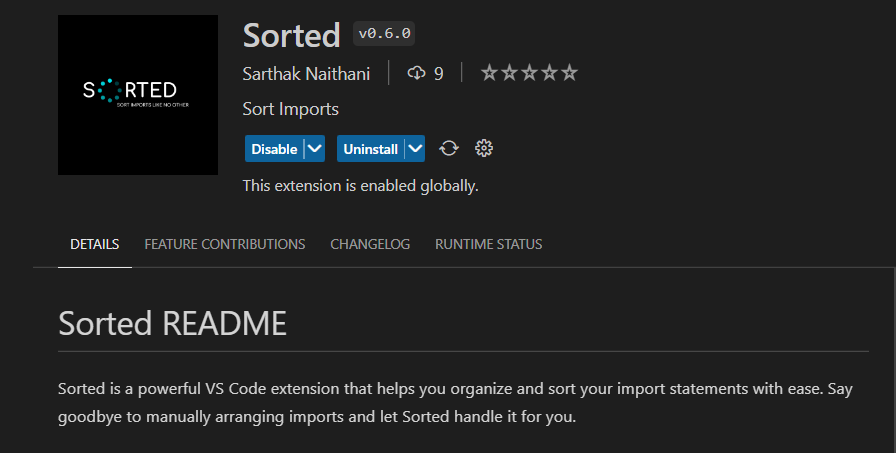
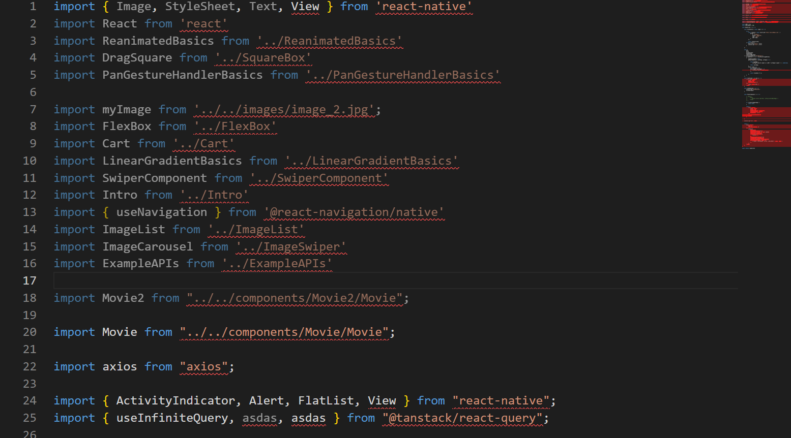

# Sorted README

Sorted is a powerful VS Code extension that helps you organize and sort your import statements with ease. Say goodbye to manually arranging imports and let Sorted handle it for you.

## Features

- `Smart Import Sorting`: Sorted intelligently sorts your imports based on the length of the import statement, grouping imports by their length.

- `Library vs. Components Sorting`: Choose how you want your imports to be sorted. Sorted can arrange imports either by library or by individual components.

- `Multi-line Import Support`: Sorted handles multi-line imports effortlessly, ensuring clean and organized import blocks in your code.

- `Remove unused imports`: This feature enhances code cleanliness by automatically removing single-line imports that are no longer utilized within the codebase.

[Extension Link](https://marketplace.visualstudio.com/items?itemName=SarthakNaithani.Sorted&ssr=false#review-details)

## Working

  
  

## How to Use

Shortcut keys
`
ctrl/cmd + k
`

- Install the Sorted extension from the Visual Studio Code Marketplace.
- Open a JavaScript or TypeScript file that contains import statements.
- Trigger the import sorting action using the provided keyboard shortcut or through the VS Code command palette.
- Watch as Sorted organizes and sorts your imports, bringing structure and clarity to your code.

## Feedback and Support

If you have any suggestions, feedback, or issues related to Sorted, feel free to open an issue on the GitHub repository. We value your input and strive to improve the extension with each release.

## Release Notes

importSort VS Code extension ver 0.6.0
